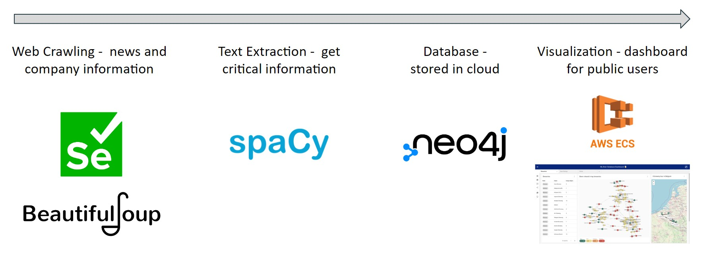
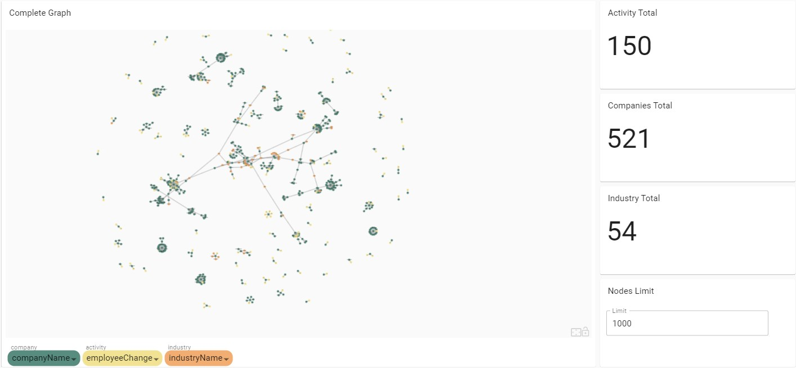
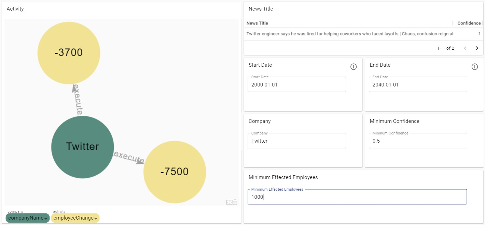
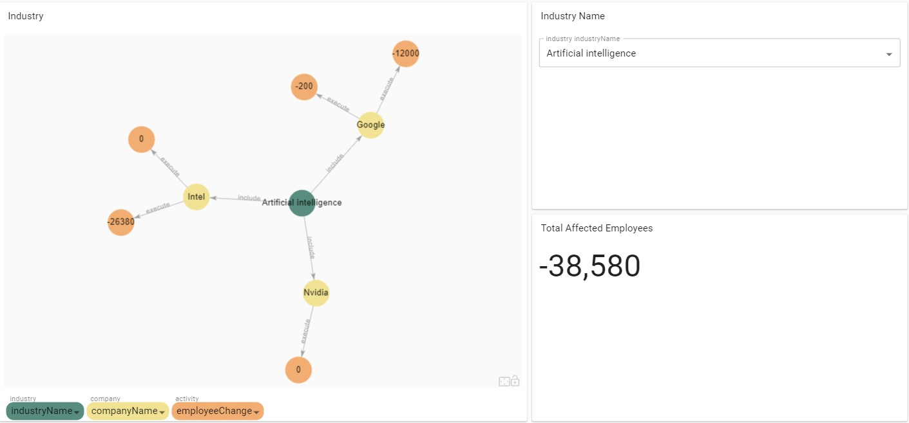
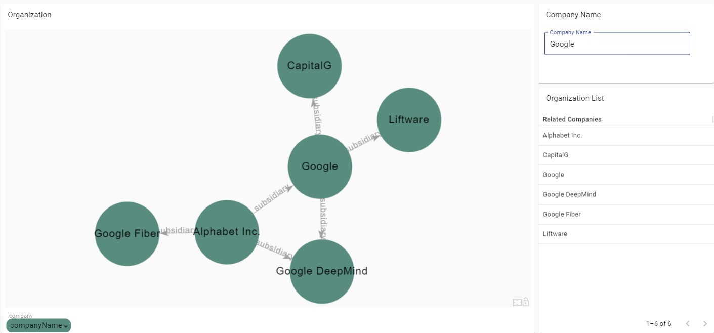
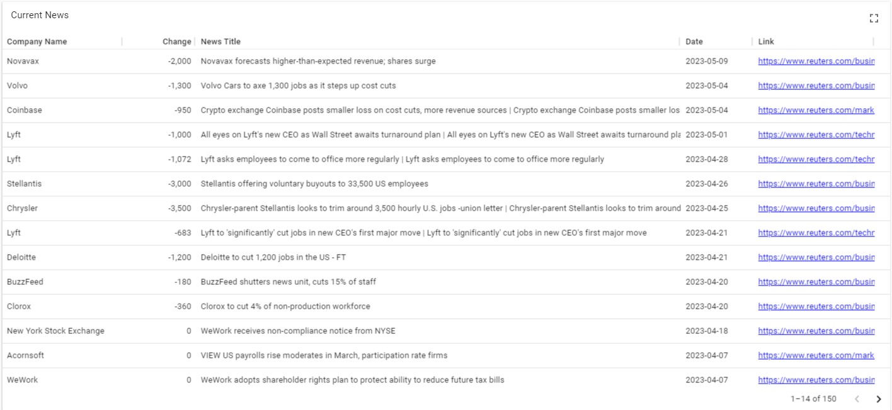

# Tech Job Analysis

### [Click here for the Demo Video](https://youtu.be/HDioOeOxR-4?feature=shared&t=701)

This repository contains code for scraping hire/layoff information on the web.

Developed by Charlene Chiang and Tsai-Chen Hsieh. 

## Project Overview
* Used Selenium to crawl news from Reuters, while using Beautiful Soup to get company-related data. 
* Utilized SpaCy, an NLP library, to extract text to structured data. 
* The data is then stored in Neo4j, a graph database. 
* Built the interactive dashboard with NeoDash and Cypher queries, while using AWS ECS to host the website.  



## Dashboard
The first page shows the whole graph, with an option the limit the size. 

You can get information on layoff activities (yellow node) and filter them. 

You can check out each industry and see its layoff activities. 

You can search companies to get the organization map, such as parent companies or subsidiaries. 

You can get the original news titles, sorted by date. 
 


## Running the data collection scripts 
Note that it does not include config, JSON, and CSV files. 

After cloning the repository and downloading all required libraries on your environment, go to your project's root directory, create `config.ini`, following the format below:
```
[reuters]
username = <reuters username>
password = <reuters password>

[neo4j]
uri = <neo4j uri>
username = <database username>
password = <database password>
```
Also, create the folder required to store the CSV files:
```bash
mkdir .csv
```
To run the script: 
```bash
python main.py
```

## Module Explanation
### Crawl the web
`crawl_reuters()` crawls Reuters to get the news. Search keyword is an input parameter, like `layoff` and `lay+off` (if your search has space, replace it with +). The next three are `startpage`: the index of the first page (usually 0), `endpage`: the total count of news for the search, `steps`: how much news for a page (usually 20). The raw data is stored in `data.json`. For each piece of news, we have the following attributes: link, title, paragraph, and date. In some rare cases where the date is not shown, then it will be replaced with `January 1 2000`.

### Make predictions
Based on the raw data, apply NLP techniques to obtain the attributes, including company, action, number, percent, and date. If it is not found, then it is null. The data is stored in `prediction.json`.

### Compose the CSV files
Use `data.json` and `prediction.json` to turn into CSV files that can be uploaded directly to the Neo4j aura web console. For each news instance, here are the steps:
1. Go through `updateCompanyInfo()`, which updates the predicted company in the database. The function recursively collects all subsidiaries/parent company related to the company, and assign a new ID to companies that are not found in the database. Every company is checked with the database first, so there are no conflicts when assigning IDs. The data must be found in Wikipedia, which is our source for companies. If the company is not found (either through \<Company Name> or \<Company Name>_(company) ), then we do not enter it into the database. If the company from the news is not found in Wikipedia, then we simply ignore the news. 
2. Compose the required data to the CSV files, under folder `.csv`. Then we can upload the data to the Neo4j Aura web console directly. 
